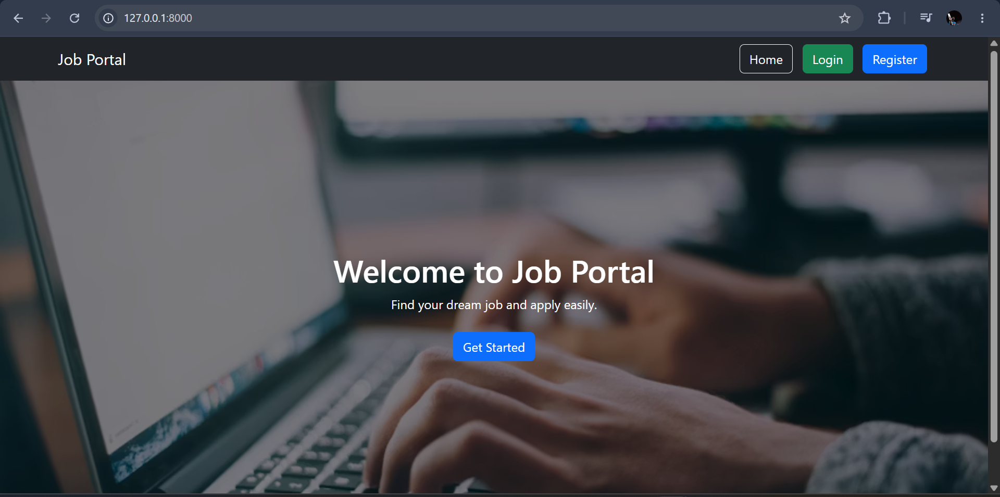

# Job Portal Web Application

A Job Portal web application built using Django that allows users to register, log in, browse available jobs, upload resumes, and apply for jobs through a secure dashboard.

## Features

- User Registration
- User Login
- User Logout
- Secure Authentication
- Browse Available Jobs
- Apply for Jobs
- Resume Upload
- User Dashboard
- Responsive Design
- Bootstrap User Interface
- Background Images

## Technologies Used

- Python
- Django
- HTML5
- CSS3
- Bootstrap 5
- SQLite3
- Git
- GitHub

## 📸 Screenshots

### 🏠 Home Page

### 🔐 Login Page

### 📝 Register Page

### 💼 Jobs Page

### 👤 Dashboard

## 📂 Project Structure

job-portal/
├── Jobs/
├── job_portal/
├── static/
├── templates/
├── media/
├── screenshots/
├── manage.py
├── requirements.txt
└── README.md

## 🌐 Live Demo

https://job-portal-wzrd.onrender.com

## 👨‍💻 Author

**Jayasuriya J**

- GitHub: https://github.com/Jayasuriya-18
